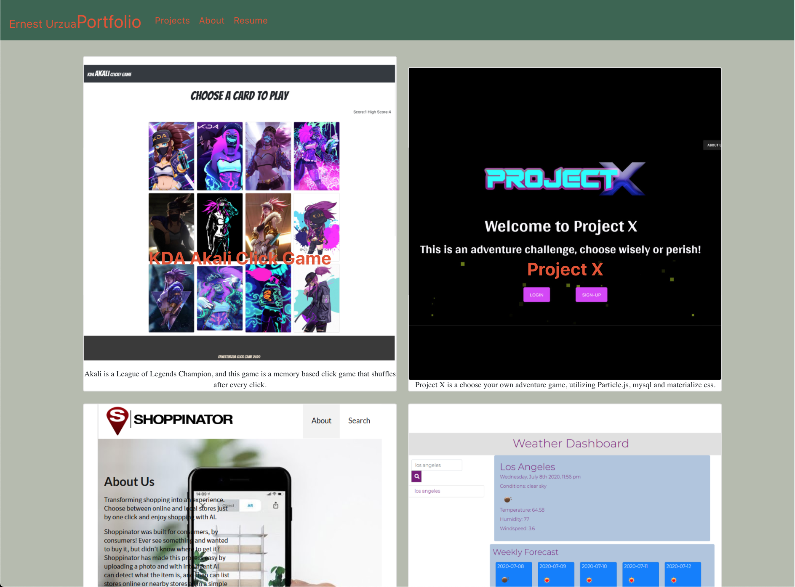

# Portfolio in React
Personal portfolio website built in React, utilizing reusable components such as header, footer, cards, etc..

## Application specifications
- must be in react.js
- must use router or other for handling routes
- must have reusable components to be used in multiple pages
    - e.g. footer, header, cards..
- updated github profile with pinned repos featuring the same projects

## Screenshots

### animated project cards have title and description with link

### footer contains links to Github and linkedIn

### about me gives a quick bio and picture

## Live Link to page
[Live Link to app](https://ernesturzua.github.io/react-portfolio/)

