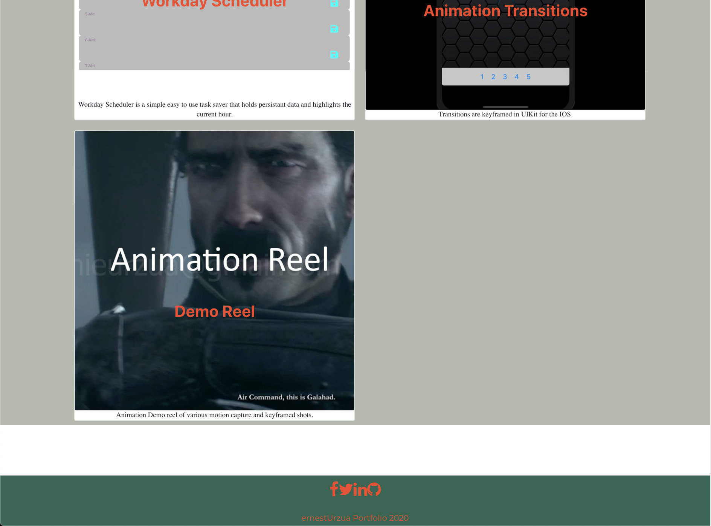
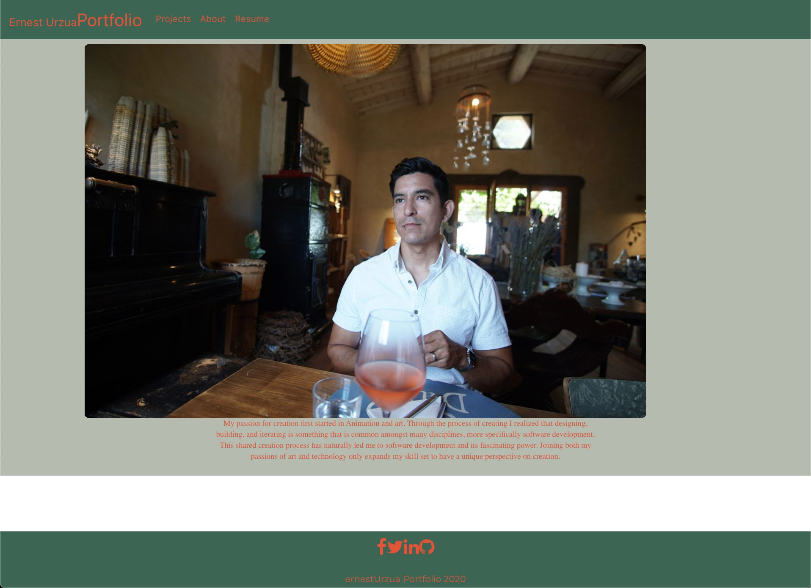

# KDA Akali Clicky Game
clicky game built in React
user must click a single image only once or else score resets.
Images get shuffled after each click for added difficulty

## Application specifications
- must be in react.js
- must keep current score and high score
- must shuffle pictures after each click 

# Screenshots

- on hover card changes color

- [Live Link to app](https://ernesturzua.github.io/kda-akali-click-game/)

* Updated portfolio featuring 6 total projects

* Use React

* A `Header` component that appears on multiple pages

* A single `Project` component that will be used multiple times on a single page 

* Navigation with React Router, dynamic rendering, or another third part router

* A `Footer` component that appears on multiple pages

* Update GitHub profile with pinned repositories featuring those same projects